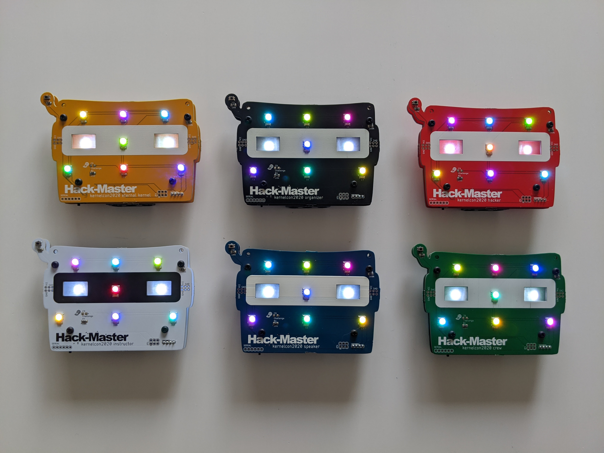
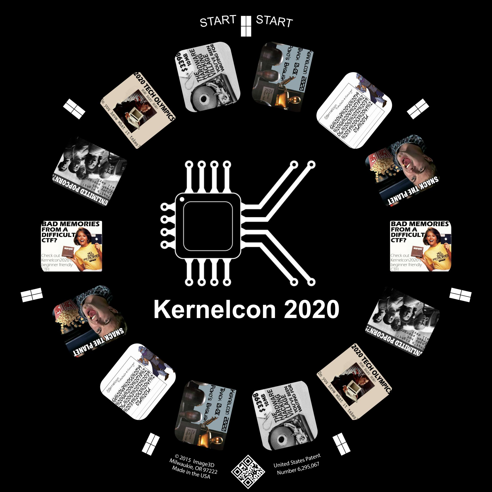

# kernelcon-2019-badge
the badge was a dual pcb design with mouting hardware carfully located to make it hold a custom image reel. controlled by an atmel atmeg328p-au. powered by 3 AAA batteries. the 9 LEDs are addressable RGBs (apa102). two act as backlights for the custom image reel. a button can be used to change modes, which are the following:
* fader mode, each LED faded between colors independently 
* freeze of of whatever the previous state was
* fader mode, all LEDs faded between colors in unison
* freeze of of whatever the previous state was
* just backlit reel
* rave mode (flashing colors)
* looping animation with a color change after each lap
* knight rider 
* windmill
* pseudorandom iterations color and LED
* pseudorandom selection of led made white (twinkle twinkle)

Check out "/reels" for what images were used to make the custom reel.

